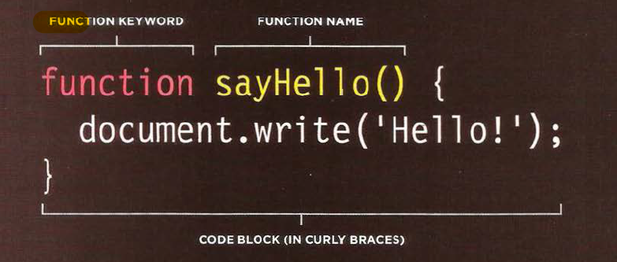
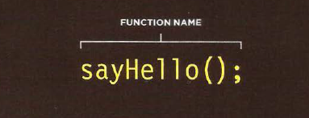
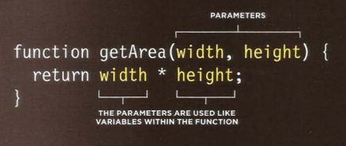

# FUNCTIONS :
Functions consist of series of statements that have been grouped together because they perform a specific task. If different parts of a script repeat the same task, you can
reuse the function (rather than repeating the same set of statements).

# DECLARING FUNCTIONS :

A JavaScript function is defined with the function keyword, followed by a name, followed by parentheses ( ).

Function names can contain letters, digits, underscores, and dollar signs (same rules as variables). The parentheses may include parameter names separated by commas:(parameter1, parameter2, ...)

The code to be executed, by the function, is placed inside curly brackets: { }

# CALLING FUNCTION :
To run the code in the function, you use the function name followed

# DECLARING FUNCTIONS THAT NEED INFORMATION

Sometimes a function needs specific information to perform its task. In such cases, when you declare the function you give it parameters. Inside the function, the parameters act like variables

  

  

