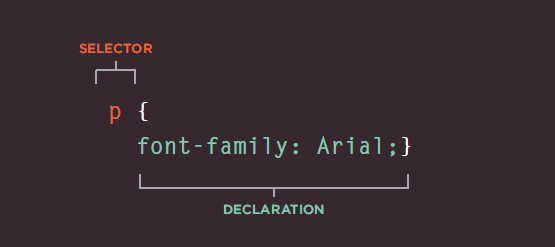

# Chapter 10 : CSS
## In this section, we will look at how to make your web pages more attractive, controlling the design of them using CSS. CSS allows you to create rules that specify how the content of an element should appear.

## A CSS rule contains two parts: a selector and a declaration.

* Selectors * indicate which element the rule applies to. 
* Declarations * indicate how the elements referred to in the selector should be styled.Declarations are split into two parts (a property and a value),and are separated by a colon.

## We Can use CSS In :
* Inline 

* Internal  : <style> You can also include CSS rules within an HTML page by placing them inside a <style> element, which usually sits inside the <head> element of the page. The <style> element should usethe type attribute to indicate that the styles are specified in CSS. The value should be text/css.

* External :
The <link> element can be used in an HTML document to tell the browser where to find the CSS file used to style the page. It is an empty element (meaning it does not need a closing tag), and it lives inside the <head> element.

It should use three attributes:
## href
## type
## rel

# CSS Selectors : 
There are many different typesof CSS selector that allow you to target rules to specific elementsin an HTML document.
|Selector| Meaning |Example|
| --- | --- |
|Universal Selector|Applies to all elements in the document|* {} Targets all elements on the page|
|Type Selector|Matches element names|h1, h2, h3  {} Targets the <h1>, <h2> and <h3> elements|
|Cl ass Selector|Matches an element whose class attribute has a value thatmatches the one specified after the period (or full stop) symbol|.note {} Targets any element whose class attribute has a value of note |
|ID Selector|Matches an element whose id attribute has a value that matches the one specified afterthe pound or hash symbol|#introduction {} Targets the element whose id attribute has a value of introduction|

# Chapter 11 : Color:
 COLOR can really bring your pages to life.The color property allows you  to specify the color of text inside an element
## You can specify any color in CSS in one of three ways :
* rgb values *
These express colors in terms of how much red, green and blue are used to make it up. For
### example: rgb(100,100,90)
* hex codes
These are six-digit codes that represent the amount of red, green and blue in a color, preceded by a pound or hash # sign.  
### For example: #ee3e80
* color names
There are 147 predefined color names that are recognized by browsers.
### For example: DarkCyan

## CSS 3: Opacity opacity, rgba
CSS3 introduces the opacity property which allows you to specify the opacity of an element and any of its child elements. The value is a number between * 0.0 and 1.0 (so a value of 0.5 is 50% opacity and 0.15 is 15% opacity).*

# CSS 3: HSL Colors
CSS3 introduces an entirely new and intuitive way to specify colors using hue, saturation, and lightness values., followed by individual values insideparentheses for:
* hue
This is expressed as an angle
(between 0 and 360 degrees).
* saturation
is the amount of gray in a color. Saturation is represented as a percentage. 100% is full saturation and 0% is a
shade of gray.
* lightness
Lightness is the amount of white (lightness) or black (darkness) in a color.This is expressed as a percentage with 0% being white, 50% being normal, and 100% being black.

