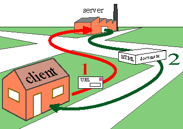
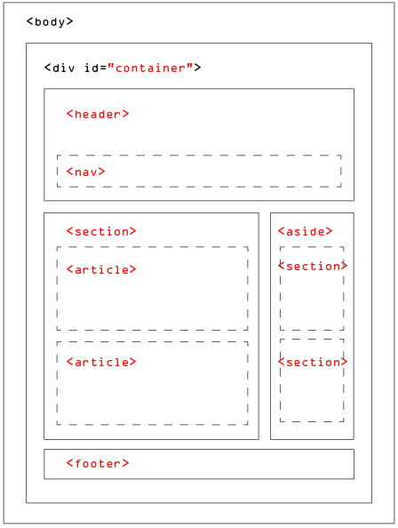

Introduction:
All websites use HTML and CSS, Understanding HTML and CSS and Java Script can help anyone who works with the web; designers can create more attractive and usable sites, website editors can create better content, marketers can communicate with their audience more effectively, and managers can commission better sites and get the best out of their teams.

HTML is used to create web pages. You then add tags or elements like text, lists, links, images, tables, forms, video audio and flash, and miscellaneous elements.

How People Access the Web?
Different ways in which people access the web and clarify some terminology:
•	Browsers  People access websites using software called a web browser. Like Firefox, Internet Explorer, Safari, Chrome, and Opera
•	Web Servers When you ask your browser for a web page, the request is sent across the Internet to a special computer known as a web server which hosts the website
•	Screen readers are programs that read out the contents of a computer screen to a user. They are commonly used by people with visual impairments.
•	Devices People are accessing websites on an increasing range of devices including desktop computers, laptops, tablets, and mobile phones.

When you visit a website, the web server hosting that site could be anywhere in the world. In order for you to find the location of the web server, your browser will first connect to a Domain Name System (DNS) server.

 
Figure 1:How  the Web Works
Chapter 2: Structure:
Structure of web page looks like newspaper or WORD document, there will be a headline, some text, and possibly some
images.
In HTML Structure of web page look like this :
HTML uses tags (characters that sit inside angled brackets) to give the information ,Tags usually come in pairs ,The opening tag and the closing tag.
  
Figure 2 Web Page Structure

# Chapter 8: Extra Markup:
## Q: Why we did use DOCTYPE?
A: Because there have been several versions of HTML, each web page should begin with a DOCTYPE declaration to tell a browser which version of HTML the page is using. In HTML5 use 
<!DOCTYPE html>

## Q: How we Can Write a Comment in HTML?
A: If you want to add a comment to your code that will not be visible in the user's browser, you can add the text between these characters:
 <!-- -->
< --This Code 201 Class  -->

## Q: Why did we use ID Attribute?
A: It is used to uniquely identify that element from other elements on the page.

## Q: what is the difference between Block Elements and in line Elements?
A: Block Elements: elements appear to start on a new line in the browser window. These are known as block level          elements. like :<h1>, 
, <ul>, and <li>.
In line Elements : appear to continue on the same line as their neighboring elements like : <a>, <b>, <em>, and .

## Q : Mention Grouping Text &Elements In a Block and inline block and describe it ?

A: The 
 and  elements allow you to group
block-level and inline elements together.
 <iframes> cut windows into your web pages through
which other pages can be displayed.
The <meta> tag allows you to supply all kinds of information about your web page.
Escape characters are used to include special characters in your pages such as <, >, and ©.

# Chapter 17: HTML5 Layout:

