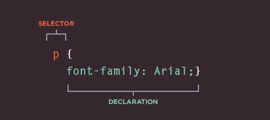

# Chapter 2 : Text 

## HEADING

### HTML has six "levels" of headings:

`<h1>` 
 # This is a Main Heading

`<h2>`
## This is a Level 2 Heading

`<h3>`
### This is a Level 3 Heading

`<h4>`
#### This is a Level 4 Heading 

`<h5>`
##### This is a Level 5 Heading

`<h6>`
###### This is a Level 6 Heading

## PARAGHAPH

`<p>` paragraph consists of one or more sentences
that form a self-contained unit of discourse. The
start of a paragraph is indicated by a new
line tag.paragraph consists of one or more sentences
that form a self-contained unit of discourse. The
start of a paragraph is indicated by a new
line tag.paragraph consists of one or more sentences
that form a self-contained unit of discourse. The
start of a paragraph is indicated by a new
line tag.paragraph consists of one or more sentences
that form a self-contained unit of discourse. The
start of a paragraph is indicated by a new
line tag.`</p>` 

## BOLD AND ITLAIC

`<b>` **we can make characters appear bold** `</b>`

`<i>` _we can make characters appear italic._`</i>`

## SUBSCRIPT & SUPSCRIPT

`<sup>` element is used
to contain characters that
should be superscript such
as the suffixes of dates or
mathematical concepts like
raising a number to a power such
as 22.
`<sub>`
The `<sub>` element is used to
contain characters that should
be subscript. It is commonly
used with foot notes or chemical
formulas such as H20.

`<br />` new line

`<hr />`
To create a break between

themes such as a change of

 you can add a horizontal rule between sectionsusing the `<hr />` tag.


 # Introduction to CSS 

 ## A CSS rule contains two parts: a selector and a declaration.
 


 Declarations indicate how the elements referred to in the selector should be styled.Declarations are split into two parts (a property and a value),and are separated by a colon.

# We Can use CSS In :
```Selectors```  indicate which element the rule applies to. 
```Declarations```  indicate how the elements referred to in the selector should be styled.Declarations are split into two parts (a ```property``` and a ```value```),and are separated by a colon.

## We Can use CSS In :
```Inline ``` : It's  used to apply css style for a one element.
```Internal ``` : ```style``` You can also include CSS rules within an HTML page by placing them inside a style element
``` External``` : The ```link``` element can be used in an HTML document to tell the browser where to find the CSS file used to style the page. It is an empty element (meaning it does not need a closing tag), and it lives inside the ```head``` element.It should use three attributes:
 ```href``` ,```type```,  ```rel```

# CSS Selectors : 
There are many different typesof CSS selector that allow you to target rules to specific elementsin an HTML document.

|Selector| Meaning |Example|
| --- | --- |
|```Universal Selector```|Applies to all elements in the document|* { } Targets all elements on the page|
|```Type Selector```|Matches element names|h1, h2, h3  { } Targets the `<h1>`, `<h2>` and `<h3>` elements|
|```Class Selector```|Matches an element whose class attribute has a value thatmatches the one specified after the period (or full stop) symbol|.note { } Targets any element whose class attribute has a value of note |
|```ID Selector```|Matches an element whose id attribute has a value that matches the one specified afterthe pound or hash symbol|#introduction { } Targets the element whose id attribute has a value of introduction|


# BASIC JAVASCRIPT INSTRUCTION

## SCRIPT 
- A **script** is a series of instructions that a computer can follow one-by-one.

- Each individual instruction or step is known as a statement.

- Statements should end with a semicolon.

- JAVASCRIPT IS CASE SENSITIVE

## COMMENTS

- You should write comments to explain what your code does.

- They help make your code easier to read and understand.

- This can help you and others who read your code.

**MULTI-LINE COMMENTS**

` /* Th i s script displays a greeting to the user based upon the current time.It is an example from JavaScript & jQuery book */ `

`var today= new Date();`
`var hour Now = today.getHours();`
`var greeting;`

**SINGLE-LINE COMMENTS**

`// Create a ne1~ dat e object`

# DATA TYPES IN JAVASCRIPT :
JavaScript distinguishes between numbers,strings, and true or false values known asBooleans.

**NUMERIC DATA TYPE**
The numeric data type handles
numbers.
`0.75`

**STRING DATA TYPE**
The strings data type consists of
letters and other characters.
`'HI' Ivy! 1`

## BOOLEAN DATA TYPE
Boolean data types can have one
of two va lues: true or false.
`true```

### RULES FOR NAMING VARIABLES

- The first character must be a letter or an underscore (_). 

- You can't use a number as the first character. The rest of the variable name can include any letter, any number, or the underscore. You can't use any other characters, including spaces, symbols, and punctuation marks.

- variable names are case sensitive. That is, a variable named Interest_Rate is treated as an entirely different variable than one named interest_rate.

- There's no limit to the length of the variable name.

- You can't use one of JavaScript's reserved words as a variable name.


### Array 
is a special type of variable. It doesn't
just store one value; it stores a list of values.


