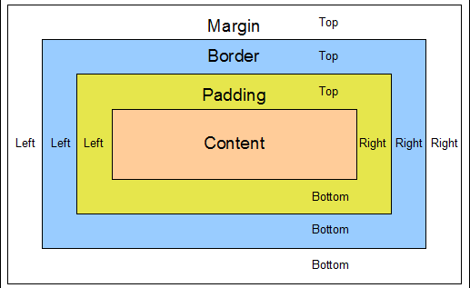

# Chapter 3 : Lists

 #### HTML provides us with three different types:
**Ordered lists** are lists where each item in the list is numbered.

The ordered list is created with the `<ol>` element.

Each item in the list is placed between an opening `<li>` tag
 1. item
 2. item
 3. item
 4. item 

**Unordered lists** are lists that begin with a bullet point(rather than characters that indicate order).

The unordered list is created with the `<ul>` element.

Each item in the list is placed between an opening `<li>` tag

* item
* item
* item
* item

**Definition lists** are made up of a set of terms along with the
definitions for each of those terms.

The definition list is created with
the `<dl>` element and usually
consists of a series of terms and
their definitions.

Inside the `<dl>` element you will
usually see pairs of `<dt>` and
`<dd`> elements.

`<dt>`
This is used to contain the term
being defined (the definition
term).

`<dd>`
This is used to contain the
definition.

we can create nested lists 
`<ul>`

`<li>`Mousses`</li>` 

`<li>`Pastries

`<ul>`

`<li>`Croissant`</li>`

`<li>`Mille-feuille`</li>`

`<li>`Palmier`</li>`

`<li>`Profiterole`</li>`

`</ul>`

`</li>`

`<li>`Tarts`</li>`

`</ul>`

# Chapter 13 : BOXS
## Box dimensions
width

height

- Limiting Width
min-width

max-width

- Limiting Height
min-height

max-height
-
Overflowing Content
- hidden
This property simply hides any extra content that does not fit in the box

- scroll
This property adds a scrollbar to the box so that users can scroll to see the missing content

## Border, Margin & Padding
Every box has three available properties that can be adjusted to control its appearance:

### Border
Every box has a border (even if it is not visible or is specified to be 0 pixels wide). The border separates the edge of one box from another

### Margin
Margins sit outside the edge of the border. You can set the width of a margin to create a gap between the borders of two adjacent boxes.

### Padding
Padding is the space between the border of a box and any content contained within it. Adding padding can increase the readability of its contents
