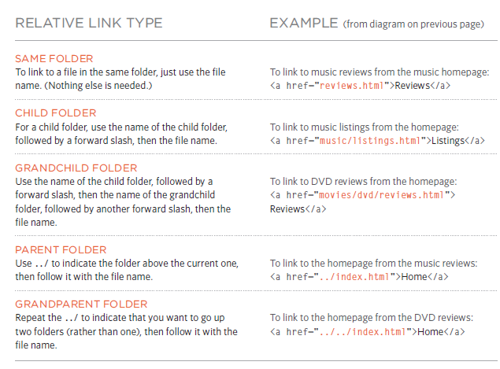
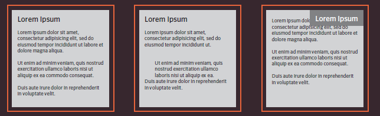
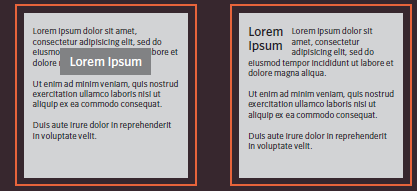

# chapter 4 : Links 

## Links are the defining feature of the web because they allow you to move from one web page to another — enabling the very idea of browsing or surfing.

Links are created using the `<a>` element.  You specify
which page you want to link to using the href attribute.

## Writing Links
`<a href="http://www.github.com">GITHUB</a>`
This is the page the
link takes you to
Opening link tag

- can Linking to Other Sites ,Linking to Other Pages
on the Sa me Site

## Relative URLs
Relative URLs can be used when linking to pages within your own
website. They provide a shorthand way of telling the browser where to
find your files.

## Emails Links
`<mailto:>` email-links.html HTML
To create a link that starts up
the user's email program and
addresses an email to a specified
email address, you use the <a>
element. However, this time the
value of the href attribute starts
with mailto: and is followed by
the email address you want the
email to be sent to.

`<a href="mailto:sajedaaraidah@gmail.com">Email sajeda</a>`
 

 ## Opening Links in a New Window
`<target>`
If you want a link to open in a
new window, you can use the
target attribute on the opening
<a> tag. The value of this
attribute should be _blank.

`<a href="http://www.ltcu.com" target="_blank"> LTUC</a> (opens in new window)`

- You can use the `id` attribute to target elements within a page that can be linked to.

# Chapter 15 : Layout :
Key Concepts in Positioning El ements

Building Blocks
CSS treats each HTML element as if it is in its
own box. This box will either be a block-level
box or an inline box.

- Block-level elements
start on a new line  Examples include: `<h1>` `
` `<ul>` `<li>`

- Inline elements
flow in between surrounding text Examples include: `` `<b>` `<i>`
! [Pic2](inlineblock.jpg)

## Controlling the Position of Elements

CSS has the following positioning schemes that allow you to control
the layout of a page: normal flow, relative positioning, and absolute
positioning. You specify the positioning scheme using the position
property in CSS. You can also float elements using the float property.

## Normal flow`                         `Relative Positioning  `                            `Absolute positioning

- box offset properties to tell the browser how far from the top or bottom
and left or right it should be placed.

## Fixed Positioning                   Floating Elements