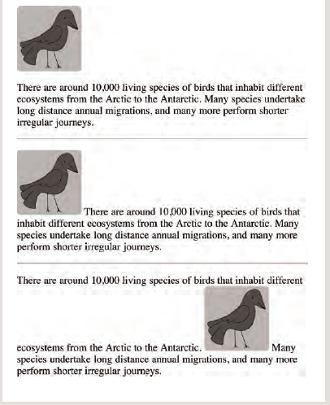

# Chapter 5 : Images
Every website includde an  image : you might want to include a logo, photograph, illustration, diagram, or chart.Images can be used to set the
tone for a site in less time than
it takes to read a description.

## Images should...
- Be relevant.
- Convey information.
- Convey the right mood.
- Be instantly recognisable.
- Fit the color palette.

## Adding Images

 To add an image into the page
you need to use an ``
element. This is an empty
element (which means there is
no closing tag) with **two attributes:**

**src**

This tells the browser where
it can find the image file.

**alt**

This provides a text description
of the image

**title**
You can also use the title
to provide additional information
about the image.

Example : 
``

The Results Will be 


## anther attributes of img :

**height**

This specifies the height of the
image in pixels.

**width**

This specifies the width of the
image in pixels.

Example : 
``

The Results Will be 


## Where to Place Images in Your Code :
- before a paragraph

- inside the start of a paragraph

- in the middle of a paragraph



## Three Rules for Creating Images

- Save images in the right format

- Save images in the right size 

- Save images in the right resolution

## Tools to Edit& Save Images

The most popular tool amongst web professionals is Adobe
Photoshop. Other Software :
- Adobe Fireworks
- Pixelmator
- PaintShop Pro
- Paint.net


`<figcaption>`

The `<figcaption>` element has
been added to HTML5 in order
to allow web page authors to add
a caption to an image.
Before these elements were
created there was no way to
associate an `` element with
its caption.

Use `GIF` or `PNG` or `JPNG` format when saving images with few colors or large areas of the same color.


# Chapter  11 : “Color”

### In this section, we will look at how to make your web pages more attractive, controlling the design of them using CSS. CSS allows you to create rules that specify how the content of an element should appear.

## A CSS rule contains two parts: a selector and a declaration.


```Selectors```  indicate which element the rule applies to. 
```Delarations```  indicate how the elements referred to in the selector should be styled.Declarations are split into two parts (a ```property``` and a ```value```),and are separated by a colon.

## We Can use CSS In :

```Inline ``` : It's  used to apply css style for a one element.
```Internal ``` : ```style``` You can also include CSS rules within an HTML page by placing them inside a style element
``` External``` : The ```link``` element can be used in an HTML document to tell the browser where to find the CSS file used to style the page. It is an empty element (meaning it does not need a closing tag), and it lives inside the ```head``` element.It should use three attributes:
 ```href``` ,```type```,  ```rel`` 
 
 [`Read More .....`](https://sajeda-araidah.github.io/reading-notes/README06b)

# Chapter  12: “Text” 

The properties that allow you to control the appearance of text can be split into two groups:

- Those that directly affect the font and its appearance
(including the typeface, whether it is **regular, bold or italic,and the size of the text**)

- Those that would have the same effect on text no matter
what font you were using (including **the color of text and the spacing between words and letters**)

## Typeface Terminology

# Serif

# Sans-Serif

# Monospace


## Units of Type Size
- Pixels 
- Percentages 
- Ems 

[Read More....](https://www.w3schools.com/css/css_text.asp)


