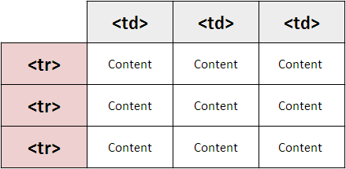
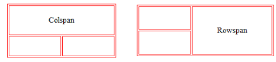
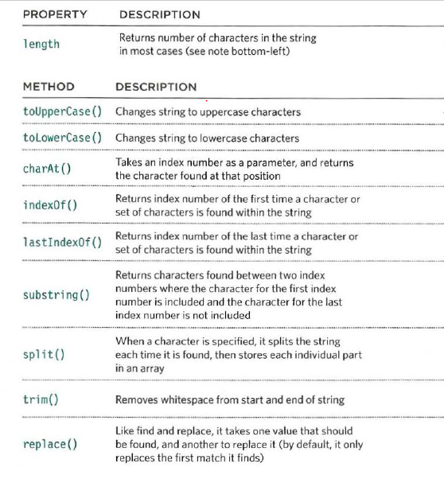
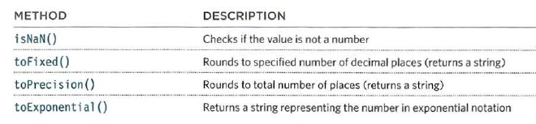
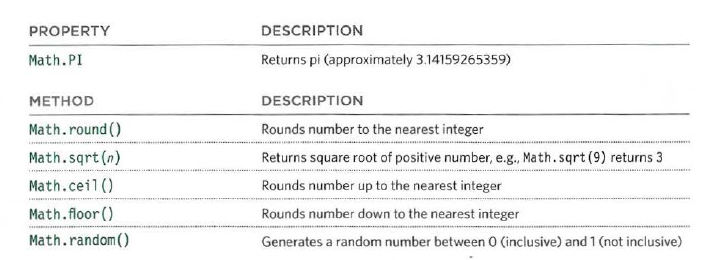
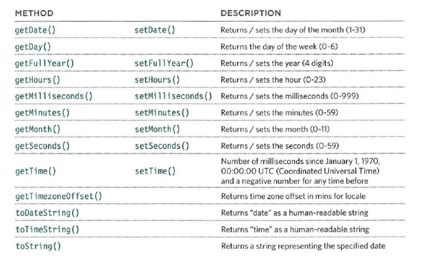

# Domain Modeling :

Domain modeling is the process of creating a conceptual model in code for a specific problem. A model describes the various entities, their attributes and behaviors, as well as the constraints that govern the problem domain. An entity that stores data in properties and encapsulates behaviors in methods is commonly referred to as an object-oriented model.

# Chapter 6 : Tabels 

## Q : What is A Table ?

### A : A table represents information in a grid format.

## Q : What is A Basic Table St ructure ?

### A :`<table>` `<tr>` `<td>`

The `<table>` element is usedto create a table. The contentsof the table are written out rowby row.

You indicate the start of each
row (The tr stands for table row.)
It is followed by one or more
`<td>` elements (one for each cell
in that row).

Each cell of a table is
represented using a `<td>`
element. (The td stands for
table data.)

## There are three elements that help distinguish between the main content of the table and the first and last rows :

`<thead>`
The headings of the table should
sit inside the <thead> element.

`<tbody>`
The body should sit inside the
<tbody> element.

`<tfoot>`
The footer belongs inside the
<tfoot> element.

- You can make cells of a table span more than one row
or column using the `rowspan` and colspan attributes.

#  JS Constructor Functions :
## The topmost object in the Document Object Model (or DOM) is the document object.

Here are some properties of the
document object, which tell you
about the current page.

|PROPERTY|                   DESCRIPTION|

| document.title            :Title of current document

| document. lastModified    :Date on which document was last modified

| document .URL             :Returns string containing URL of current document

| document.domain            :Returns domain of current document|

# GLOBAL OBJECTS:

## STRING OBJECT

# In JavaScript there are six data types:

## SIMPLE OR PRIMITIVE DATA TYPES

JavaScript has five simple (or primitive) data types:
1. String
2. Number
3. Boolean
4. Undefined (a variable that has been declared, but
no value has been assigned to it yet)
5. Null (a variable with no value - it may have had

## COMPLEX DATA TYPE

JavaScript also defines a complex data type:

6.0bject

## NUMBER OBJECT

## MATH OBJECT

## DATE OBJECT (AND TIME)

