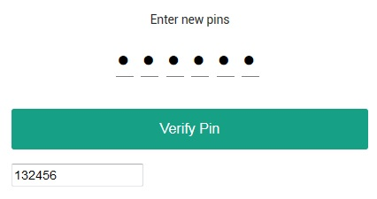
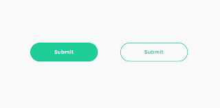
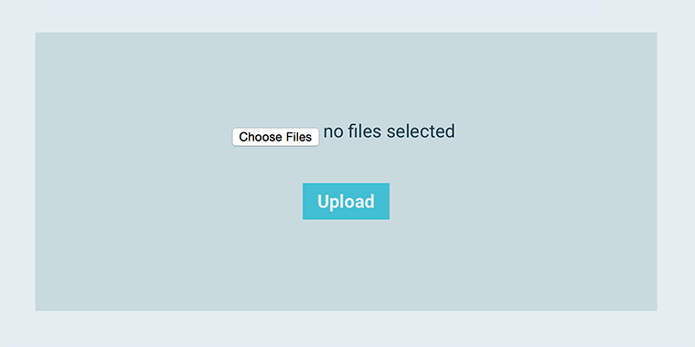
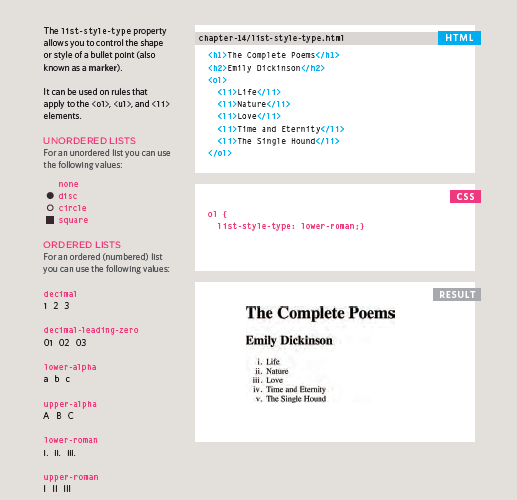

 # Chapter 7: Forms :

 ### HTML borrows the concept of a form to refer to different elements that allow you to collect information from visitors to your site. 

 # Form Controls: 
 There are  several control that you can use to collect information from visitors to your site.
 
 # Adding Text :
- **Text input (single-line)** Used for a single line of _text_ suchas _email addresses_ and _names_.

`
Username:<input type="text" name="username" size="15"maxlength="30" />
`

Username:
<input type="text" name="username" size="15"
maxlength="30" />

- **Password input** Like a single line text box but it masks the characters entered.

`
Password: <input type="password" name="password" size="15"maxlength="30" />
`

Password:
<input type="password" name="password" size="15"
maxlength="30" />

- **Text area (multi-line)** For longer areas of text, such as messages and comments.

# Making Choices 
- **Checkboxes** When a user can select and unselect one or more options.
- **Radio buttons** For use when a user must select one of a number of options.
- **Drop-down boxes** When a user must pick one of a number of options from a list.

# Submitting Forms:
- **Image buttons** Similar to submit buttons but they allow you to use an image.
- **Submit buttons** To submit data from your form to another web page.
`
Subscribe to our email list:
<input type="submit" name="subscribe"value="Subscribe" />`

Subscribe to our email list:

<input type="submit" name="subscribe"
value="Subscribe" />

- **File upload**
Allows users to upload files
(e.g. images) to a website.

## Form Structure
`<form>` This element
should always carry the action
attribute and will usually have a
method and id attribute too.

`<action>`
Every <form> element requires
an action attribute. Its value
is the URL for the page on the
server that will receive the
information in the form when it
is submitted.

`<method>`
Forms can be sent using one of
two methods: get or post.

## HTML5 introduces new form elements which make it
- **Date Input**
if you are asking the user for a
date you can use an <input>
element and give the type
attribute a value of date.

- **Email & URL Input**A URL input can be used when
you are asking a user for a web
page address.

- **Search Input**
If you want to create a single
line text box for search queries,
HTML5 provides a special
search input.

# Chapter 14 : Lists, Tables and Forms

- `list-style-type`

## Table Proparities
- `<width>`
 to set the width of the
table

- `<padding>`
 to set the space
between the border of each table
cell and its content

- `<text-transform>`
 to convert the
content of the table headers to
uppercase

- `<letter-spacing, font-size>`
to add additional styling to the
content of the table headers

- `<border-top, border-bottom>`
to set borders above and below
the table headers

- `<text-align>`
 to align the writing
to the left of some table cells and
to the right of the others

-`<background-color>`
 to change the background color of the
alternating table rows

- `<:hover>`
 to highlight a table row
when a user's mouse goes over it

