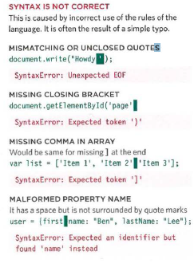

# Chapter 10 : Handeling And Debugging

When writing a long script, nobody gets everything right in their first attempt. The error
messages that a browser gives look cryptic at first, but they can help you determine what
went wrong in your JavaScript and how to fix it.

- ORDER OF EXECUTION
To find the source of an error, it helps to know how scripts are processed.
The order in which statements are executed can be complex.

- EXECUTION CONTEXTS
The JavaScript interpreter uses the concept of execution contexts.
There is one global execution context; plus, each function creates a new
new execution context. They correspond to variable scope.

**EXECUTION CONTEXT**

Every statement in a script lives in one of three
execution contexts:
**GLOBAL CONTEXT**
Code that is in the script, but not in a function.
There is only one global context in any page.
**FUNCTION CONTEXT**
Code that is being run within a function.
Each function has its own function context.
**EVAL CONTEXT (NOT SHOWN)**
Text is executed like code in an internal function
called eval ().

## ERROR OBJECTS CONTINUED

**Syntax Error**

_SYNTAX IS NOT CORRECT_
This is caused by incorrect use of the rules of the
language. It is often the result of a simple typo.

**Ref erenceError**

_VARIABLE DOES NOT EXIST_
This is caused by a variable that is not declared or is
out of scope.

**EvalError**
_INCORRECT USE OF eval() FUNCTION_
The eva l () function evaluates text through the
interpreter and runs it as code (it is not discussed
in this book). It is rare that you would see this type
of error, as browsers often throw other errors when
they are supposed to throw an Eva 1 Error.

**URI Error**
INCORRECT USE OF URI FUNCTIONS
If these characters are not escaped in URls, they will
cause an error: / ? & I : ;

## Object Error

**Type Error**
VALUE IS UNEXPECTED DATA TYPE
This is often caused by trying to use an object or
method that does not exist.

**RangeError**
NUMBER OUTSIDE OF RANGE
If you call a function using numbers outside of its
accepted range.