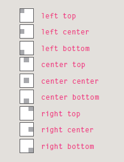

# Chapter 16 : Images 
### Controlling the size and alignment of your images using CSS keeps rules that affect the presentation of your page in the CSS and out of the HTML markup.

## Controlling Sizes of Images in Css 

You can control the size of an
image using the width and
height properties in CSS.

`img { width: 500px;height: 500px;}`

`img.medium {width: 250px;height: 250px;}`

`img.small {width: 100px;height: 100px;}`

## Background Images
- background-image

## Repeating Images
background-repeat
background-attachment

## The background-repeat**
property can have four values:
 property can have four values:

### - repeat
The background image is
repeated both horizontally and
vertically

### - repeat-x
The image is repeated
horizontally only (as shown in
the first example on the left).

### - repeat-y
The image is repeated vertically
only.

### - no-repeat
The image is only shown once.

## The background-attachment
property specifies whether a
background image should stay in
one position or move as the user
scrolls up and down the page. It
can have one of two values:

### - fixed
The background image stays in
the same position on the page.

### - scroll
The background image moves
up and down as the user scrolls
up and down the page.

## Background Position
background-position

# Chapter 19: “Practical Information

## Q : What is SEO ?
### A :SEO is a huge topic and several books have been written on the subject.The following pages will help you understand the key concepts so you can improve your website's visibility on search engines.

## Q : What is SEO  stander  for  ?
### A :Search Engine Optimization

## Q : What is On-Page Techniques ?
### A :On-page techniques are the methods you can use on your web pages to improve their rating in search engines. The main component of this is looking at keywords that people are likely to enter into a search engine if they wanted to find your site, and then including these in the text and HTML code for your site in order to help the search engines know that your site covers these topics.

- Analytics tools such as Google Analytics allow you to
see how many people visit your site, how they find it,
and what they do when they get there.

- To put your site on the web, you will need to obtain a
domain name and web hosting.

- FTP programs allow you to transfer files from your
local computer to your web server.

- Many companies provide platforms for blogging, email
newsletters, e-commerce and other popular website
tools (to save you writing them from scratch).

# HTML5 video and audio
The `<video>` and `<audio>` elements allow us to embed video and audio into web pages. As we showed in Video and audio content, a typical implementation looks like this:

