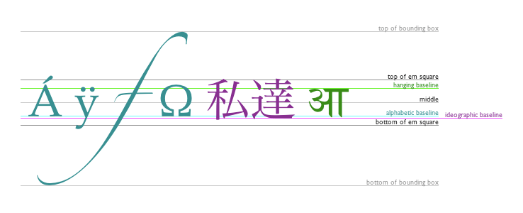

# Charts 

# Why use charts :
## Charts are far better for displaying data visually than tables and have the added benefit that no one is ever going to press-gang them into use as a layout tool. They’re easier to look at and convey data quickly, but they’re not always easy to create.

# What is The Types of Chart :
##  pie chart , bar chart , line chart

# How To create charts :
## It's easy to get started with Chart.js. All that's required is the script included in your page along with a single `<canvas>` node to render the chart.

## Drawing a line chart:To draw a line chart, the first thing we need to do is create a canvas element in our HTML in which Chart.js can draw our chart. So add this to the body of our HTML page:

`<canvas id="buyers" width="600" height="400"></canvas>`

## Next, we need to write a script that will retrieve the context of the canvas, so add this to the foot of your body element:

``

## Inside the same script tags we need to create our data, in this instance it’s an object that contains labels for the base of our chart and datasets to describe the values on the chart. Add this immediately above the line that begins ‘var buyers=’:

var buyerData = {

	labels :["January","February","March","April","May","June"],

	datasets : [

		{

			fillColor : "rgba(172,194,132,0.4)",

			strokeColor : "#ACC26D",

			pointColor : "#fff",

			pointStrokeColor : "#9DB86D",

			data : [203,156,99,251,305,247]
		}
	]
}

## Drawing a pie chart
Our line chart is complete, so let’s move on to our pie chart. First, we need the canvas element:

`<canvas id="countries" width="600" height="400"></canvas>`

Next, we need to get the context and to instantiate the chart:

var countries= document.getElementById("countries").getContext("2d");

new Chart(countries).Pie(pieData, pieOptions);

## Drawing rectangles
Unlike SVG,lines). All other shapes must be created by combining one or more paths. Luckily, we have an assortment of path drawing functions which make it possible to compose very complex shapes.

### There are three functions that draw rectangles on the canvas:

**fillRect(x, y, width, height)**
Draws a filled rectangle.

**strokeRect(x, y, width, height)**
Draws a rectangular outline.

**clearRect(x, y, width, height)**
Clears the specified rectangular area, making it fully transparent.

## Lines
For drawing straight lines, use the lineTo() method.

**lineTo(x, y)**
Draws a line from the current drawing position to the position specified by x and y.

##Drawing text##
The canvas rendering context provides two methods to render text:

**fillText(text, x, y [, maxWidth])**
Fills a given text at the given (x,y) position. Optionally with a maximum width to draw.

**strokeText(text, x, y [, maxWidth])**
Strokes a given text at the given (x,y) position. Optionally with a maximum width to draw.

## Styling text
 There are some more properties which let you adjust the way the text gets displayed on the canvas:

**font = value**
The current text style being used when drawing text. This string uses the same syntax as the CSS font property. The default font is 10px sans-serif.

**textAlign = value**
Text alignment setting. Possible values: start, end, left, right or center. The default value is start.

**textBaseline = value**
Baseline alignment setting. Possible values: top, hanging, middle, alphabetic, ideographic, bottom. The default value is alphabetic.

**direction = value**
Directionality. Possible values: ltr, rtl, inherit. The default value is inherit.
These properties might be familiar to you, if you have worked with CSS before.

