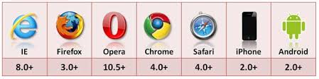

# LOCAL STORAGE FOR WEB APPLICATIONS

## What is HTML5 Storge ?
It’s a way for web pages to store named key/value pairs locally, within the client web browser. Like cookies, this data persists even after you navigate away from the web site, close your browser tab, exit your browser, or what have you. Unlike cookies, this data is never transmitted to the remote web server (unless you go out of your way to send it manually). Unlike all previous attempts at providing persistent local storage, it is implemented natively in web browsers, so it is available even when third-party browser plugins are not.

## HTML5 STORAGE SUPPORT
- IE 8.0+	   					
- FIREFOX 3.5+					
- SAFARI 4.0+
- CHROME 4.0+
- OPERA 10.5+
- IPHONE 2.0+
- ANDROID 2.0+

# USING HTML5 STORAGE

HTML5 Storage is based on named key/value pairs. You store data based on a named key, then you can retrieve that data with the same key. The named key is a string. The data can be any type supported by JavaScript, including strings, Booleans, integers, or floats. However, the data is actually stored as a string. If you are storing and retrieving anything other than strings, you will need to use functions like parseInt() or parseFloat() to coerce your retrieved data into the expected JavaScript datatype.

# TRACKING CHANGES TO THE HTML5 STORAGE AREA
If you want to keep track programmatically of when the storage area changes, you can trap the storage event. The storage event is fired on the window object whenever setItem(), removeItem(), or clear() is called and actually changes something