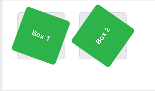
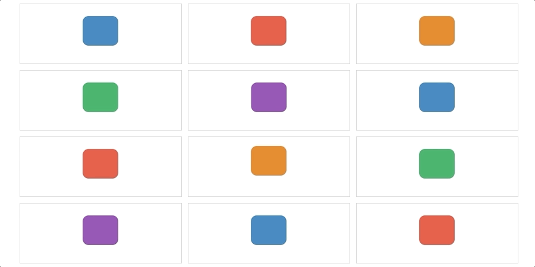
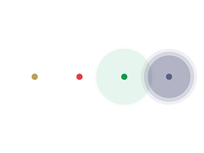
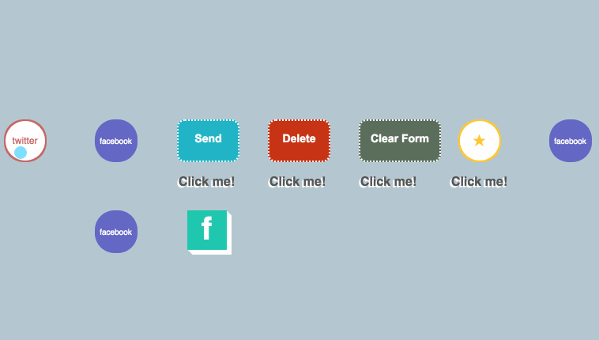

# CSS# :Transforms
ith CSS3 came new ways to position and alter elements. Now general layout techniques can be revisited with alternative ways to size, position, and change elements Byusing <trnsform> property

The transform property allows you to visually manipulate an element by skewing, rotating, translating, or scaling:

The transform property comes in two different settings, two-dimensional and three-dimensiona

## 2D Transforms
Elements may be distorted, or transformed, on both:

- **Two-dimensional** transforms work on the **x** and **y** axes, known as horizontal and vertical axes.
-**Three-dimensional** transforms work on both the **x** and **y** axes, as well as the **z** axis.

### 2D Rotate
The transform property accepts a handful of different values. The rotate value provides the ability to rotate an element from 0 to 360 degrees. Using a positive value will rotate an element clockwise, and using a negative value will rotate the element counterclockwise

`.box-1 {`

 ` transform: rotate(20deg);`

`}`

`.box-2 {`

 ` transform: rotate(-55deg);`

`}`

### 2D Scale
Using the scale value within the transform property allows you to change the appeared size of an element. The default scale value is 1, therefore any value between .99 and .01 makes an element appear smaller while any value greater than or equal to 1.01 makes an element appear larger

## 2D Skew
The last transform value in the group, skew, is used to distort elements on the horizontal axis, vertical axis, or both. The syntax is very similar to that of the scale and translate values. Using the skewX value distorts an element on the horizontal axis while the skewY value distorts an element on the vertical axis. To distort an element on both axes the skew value is used, declaring the x axis value first, followed by a comma, and then the y axis value.%p

The distance calculation of the skew value is measured in units of degrees. Length measurements, such as pixels or percentages, do not apply here.

### 3D Transforms
Working with two-dimensional transforms we are able to alter elements on the horizontal and vertical axes, however there is another axis along which we can transform elements. Using three-dimensional transforms we can change elements on the z axis, giving us control of depth as well as length and width.

3D Rotate
So far we’ve discussed how to rotate an object either clockwise or counterclockwise on a flat plane. With three-dimensional transforms we can rotate an element around any axes. To do so, we use three new transform values, including rotateX, rotateY, and rotateZ.

Using the rotateX value allows you to rotate an element around the x axis, as if it were being bent in half horizontally. Using the rotateY value allows you to rotate an element around the y axis, as if it were being bent in half vertically. Lastly, using the rotateZ value allows an element to be rotated around the z axis.

As with the general rotate value before, positive values will rotate the element around its dedicated axis clockwise, while negative values will rotate the element counterclockwise.

# Some Example for Css animation 

### Button Animation 

