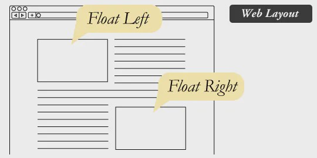
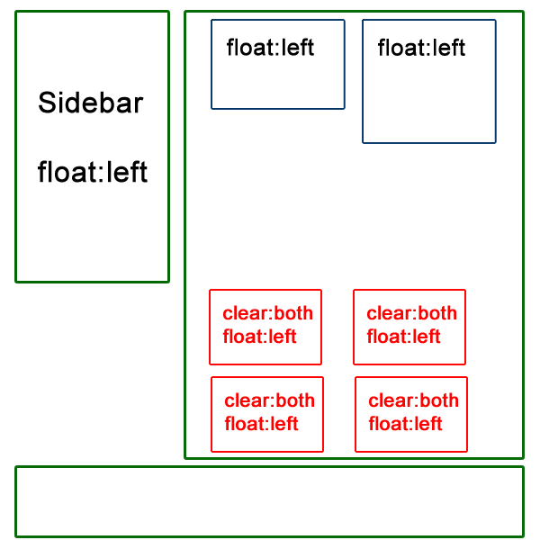
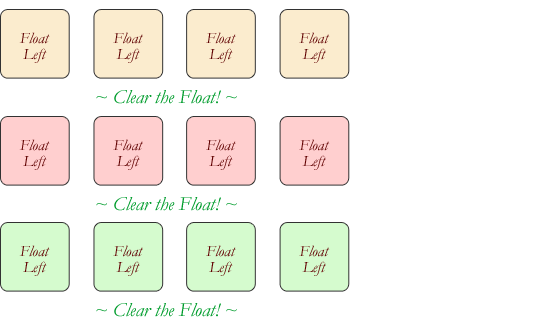

## Responsive Web Design
is the practice of building a website suitable to work on every device and every screen size, no matter how large or small, mobile or desktop. Responsive web design is focused around providing an intuitive and gratifying experience for everyone. Desktop computer and cell phone users alike all benefit from responsive websites.

## Responsive vs. Adaptive vs. Mobile
Responsive generally means to react quickly and positively to any change. adaptive means to be easily modified for a new purpose or situation, such as change. A combination of the two is ideal, providing the perfect formula for functional websites. Which term is used specifically doesn’t make a huge difference.

Mobile, on the other hand, generally means to build a separate website commonly on a new domain solely for mobile users.Mobile websites can be extremely light but they do come with the dependencies of a new code base and browser sniffing, all of which can become an obstacle for both developers and users.

Currently the most popular technique lies within responsive web design

## Flexible Layouts
Responsive web design split to three components

**flexible layout**
**media queries**
**flexible media**

## What is “Float”?

Float is a CSS positioning property. To understand its purpose and origin, we can look to print design. In a print layout, images may be set into the page such that text wraps around them as needed. This is commonly and appropriately called “text wrap”. Here is an example of that.

In web design, page elements with the CSS float property applied to them are just like the images in the print layout where the text flows around them. Floated elements remain a part of the flow of the web page.

## Clearing the Float
Float’s sister property is clear. An element that has the clear property set on it will not move up adjacent to the float like the float desires, but will move itself down past the float. Again an illustration probably does more good than words do.

## Techniques for Clearing Floats
- The Empty Div Method .

- The Overflow Method .

- The Easy Clearing Method .

