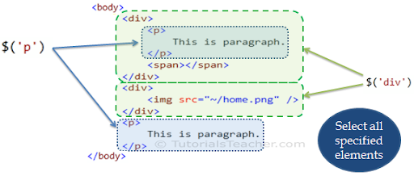
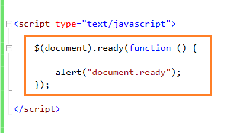

# HTML5 Event 
## Here are three page-level events that have been included in versions of the HTMLS

|Event|Target|
|`DOMContentLoaded`|Event fires when the DOM tree is formed (images, CSS, and JavaScript might still be loading).|
|`hashchange`|Event fires when the URL hash changes (without the entire
window refreshing).|
|`beforeun load`|Event fires on the window object before the page is unloaded.|

# jQuery 
## jQuery offers a simple way to achieve a variety of common JavaScript tasks quickly and consistently, across all major browsers and without any fallback code needed.

## What is JQUERY ?
JQuery is a javaScript File that you include in your webpages . It let you find elements using CSS- style selectors and than do something with elements using jQuery methods .

- find Elements using css-style selectrs 

## WHY USE JQUERY?
jQuery doesn't do anything you cannot achieve with pure JavaScript.
It is just a JavaScript file but estimates show it has been used on over a
quarter of the sites on the web, because it makes coding simpler.

## Checking  a Page  is Ready To Work 
JQuery's `.ready()` method checks that the page is ready for your code to work with .

## GETTING ELEMENT CONTENT
The `• html ()` and `• text ()` methods both retrieve and update the content
of elements.

`.html()`
When this method is used to retrieve information from a jQuery selection, it retrieves only the HTML inside the first element in the matched set, along
with any of its descendants.

`.text()`
When this method is used to retrieve the text from a jQuery selection, it returns the content from every element in the jQuery selection, along with the text
from any descendants.

## UPDATING ELEMENTS
Here are four methods that update the content of all elements in a jQuery selection .

When the `• htm 1 ()` and `. text ()`
methods are used as setters (to
update content) they will replace
the content of each element in
the matched set (along with any
content and child elements).

The `. replaceWith ()` and
`. remove ()` methods replace and
remove the elements they match
(as well as their content and any
child elements).

## GETTING AND SETTING ATTRIBUTE VALUES

`.attr()`
This method can get or set a
specified attribute and its va lue.
To get the value of an attribute,
you specify the name of the
attribute in the parentheses.
`$( ' li#one').attr('id');`
To update the value of an
attribute, you specify both the
attribute name and its new value.
`$('li#one').attr('id' , 'hot ' );`

`. addCl ass()`
This method adds a new value
to the existing value of the cl ass
attribute. It does not overwrite
existing values.

`. removeAttr()`
This method removes a specified
attribute (and its value). You just
specify the name of the attribute
that you want to remove from the
element in the parentheses.
`$('1 i #one') . removeAttr (' i d' };`

`.removeClass()`
This method removes a value
from the cl ass attribute, leaving
any other class names within
that attribute intact.

## GETTING & SETTING CSS PROPERTIES
The `. css ()` method lets you retrieve
and set the values of CSS properties.

`var backgroundColor = $( ' li ' ) . css( 'background-color' );`

## LOADING JQUERY FROM A CDN
When a page loads jQuery from
a CDN, you will often see a
syntax like the one shown below.
It starts with a `<script>` tag that
tries to load the jQuery file from
the CDN. But note that the URL
for the script starts with two
forward slashes (not http:).

This is known as a protocol
relative URL. If the user is
looking at the current page
through https, then they will not
see an error that tells them there
are unsecure items on the page.
Note: This does not work locally
with the f i l e:// protocol.

This is often followed by a
second <script> tag that
contains a logical operator,
which checks to see if jQuery
has loaded. If it has not loaded,
the browser tries to load the
jQuery script from the same
server as the rest of the website.

## EXTENDING JQUERY WITH PLUGINS
jQuery is an example of what programmers call a JavaScript library.
It is a JavaScript file that you include in your page, which then lets you
use the functions, objects, methods, and properties it contains.

## Why pair program?
While learning to code, developers likely study several programming languages. Similar to a foreign language class, there are four fundamental skills that help anyone learn a new language: Listening: hearing and interpreting the vocabulary Speaking: using the correct words to communicate an idea Reading: understanding what written language intends to convey Writing: producing from scratch a meaningful

Pair programming touches on all four skills: developers explain out loud what the code should do, listen to others’ guidance, read code that others have written, and write code themselves.