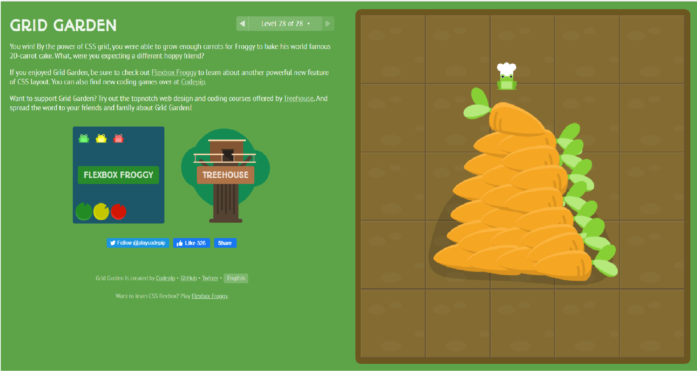

# Grid
Defines the element as a grid container and establishes a new grid formatting context for its contents.

Values:

grid – generates a block-level grid
inline-grid – generates an inline-level grid
`.container { display: grid | inline-grid;} `
grid-template-columns
grid-template-rows
Defines the columns and rows of the grid with a space-separated list of values. The values represent the track size, and the space between them represents the grid line.

Values:

`<track-size>` – can be a length, a percentage, or a fraction of the free space in the grid (using the fr (Links to an external site.) unit)
`<line-name>` – an arbitrary name of your choosing
`.container {`
  `grid-template-columns:  ... |   ...;`
`  grid-template-rows:  ... |   ...;}`
Examples:

When you leave an empty space between the track values, the grid lines are automatically assigned positive and negative numbers:

`.container {`
 ` grid-template-columns: 40px 50px auto 50px 40px;`
 ` grid-template-rows: 25% 100px auto;`
}`

But you can choose to explicitly name the lines. Note the bracket syntax for the line names:

`.container {`
 ` grid-template-columns: [first] 40px [line2] 50px [line3] auto [col4-start] 50px [five] 40px [end];`
 ` grid-template-rows: [row1-start] 25% [row1-end] 100px [third-line] auto [last-line];`
`}`

## Grid with user named lines
### grid-template-areas
Defines a grid template by referencing the names of the grid areas which are specified with the grid-area property. Repeating the name of a grid area causes the content to span those cells. A period signifies an empty cell. The syntax itself provides a visualization of the structure of the grid.

Values:

<grid-area-name> – the name of a grid area specified with grid-area (Links to an external site.)
. – a period signifies an empty grid cell
none – no grid areas are defined
 

 

That’ll create a grid that’s four columns wide by three rows tall. The entire top row will be composed of the header area. The middle row will be composed of two main areas, one empty cell, and one sidebar area. The last row is all footer.

 
 

Each row in your declaration needs to have the same number of cells.

 

 

