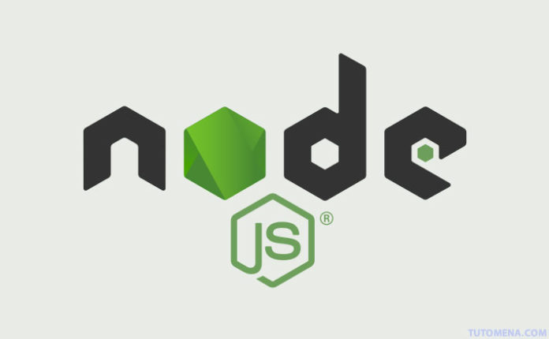

## What is Node.js?
- Node.js is an open source server environment
- Node.js is free
- Node.js runs on various platforms (Windows, Linux, Unix, Mac OS X, etc.)
- Node.js uses JavaScript on the server

## Why Node.js?
* Node.js uses asynchronous programming!
 A common task for a web server can be to open a file on the server and return the content to the client.

**Here is how PHP or ASP handles a file request:**
- Sends the task to the computer's file system.
- Waits while the file system opens and reads the file.
- Returns the content to the client.
- Ready to handle the next request.

**Here is how Node.js handles a file request:**
- Sends the task to the computer's file system.
- Ready to handle the next request.
- When the file system has opened and read the file, the server returns the content to the client.

* Node.js eliminates the waiting, and simply continues with the next request.
* Node.js runs single-threaded, non-blocking, asynchronously programming, which is very memory efficient.

## What Can Node.js Do?
- Node.js can generate dynamic page content
- Node.js can create, open, read, write, delete, and close files on the server
- Node.js can collect form data
- Node.js can add, delete, modify data in your database
 

## What is a Node.js File?
Node.js files contain tasks that will be executed on certain events
A typical event is someone trying to access a port on the server
Node.js files must be initiated on the server before having any effect
Node.js files have extension ".js.

 **we need to create a JavaScript file. Let's name it server.js:**

`var http = require("http");`
`http.createServer(function(request, response) {`
  `response.writeHead(200, {"Content-Type": "text/plain"});`
  `response.write("It's alive!");`
 ` response.end();`
`}).listen(3000);`

  
## What is Heroku?
is a cloud platform as a service (PaaS) supporting several programming languages. One of the first cloud platforms, Heroku has been in development since June 2007, when it supported only the Ruby programming language, but now supports Java, Node.js, Scala, Clojure, Python, PHP, and Go. For this reason, Heroku is said to be a polyglot platform as it has features for a developer to build, run and scale applications in a similar manner across most languages. Heroku was acquired by Salesforce.com in 2010 for $212 million

## Why used Heroku?
Heroku is fully managed, giving developers the freedom to focus on their core product without the distraction of maintaining servers, hardware, or infrastructure. The Heroku experience provides services, tools, workflows, and polyglot support—all designed to enhance developer productivity.
 

 